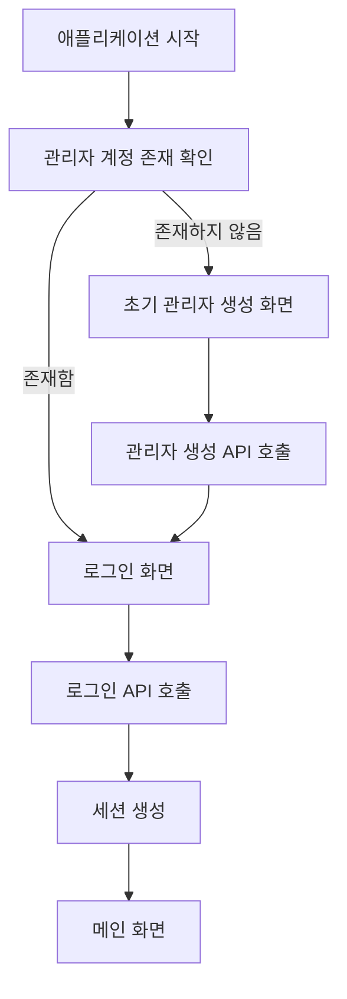

# 프론트엔드 개발자를 위한 API 연동 가이드

> **Framework Core Back-end API v0.0.1**
> 최종 업데이트: 2026-01-08

---

## 📋 목차

1. [시작하기](#1-시작하기)
2. [인증 및 세션 관리](#2-인증-및-세션-관리)
3. [사용자 관리](#3-사용자-관리)
4. [권한 및 메뉴 관리](#4-권한-및-메뉴-관리)
5. [공통 코드 관리](#5-공통-코드-관리)
6. [게시판 시스템](#6-게시판-시스템)
7. [배치 작업 관리](#7-배치-작업-관리)
8. [API Key 관리](#8-api-key-관리)
9. [에러 처리](#9-에러-처리)
10. [개발 가이드라인](#10-개발-가이드라인)

---

## 1. 시작하기

### 1.1 기본 정보

**Base URL**: `http://localhost:8080`
**Content-Type**: `application/json`
**인증 방식**: Session-based (Cookie)

### 1.2 환경 설정

```javascript
// API Client 설정 예시 (Axios)
import axios from 'axios';

const apiClient = axios.create({
  baseURL: 'http://localhost:8080',
  timeout: 10000,
  withCredentials: true, // 쿠키 포함 (중요!)
  headers: {
    'Content-Type': 'application/json',
  },
});

export default apiClient;
```

### 1.3 CORS 설정

백엔드는 다음 Origin을 허용합니다:
- `http://localhost:3000` (React 기본 포트)

추가 Origin이 필요한 경우 백엔드 팀에 요청하세요.

### 1.4 초기 설정 플로우



---

## 2. 인증 및 세션 관리

### 2.1 초기 관리자 계정 생성

**첫 실행 시** 관리자 계정이 없으면 자동으로 생성해야 합니다.

#### 2.1.1 관리자 존재 확인

```http
GET /users/admin/exists
```

**Response 200 OK**:
```json
{
  "exists": false
}
```

#### 2.1.2 초기 관리자 생성

```http
POST /users/admin/initial
```

**Request Body**:
```json
{
  "userId": "admin",
  "password": "admin1234!",
  "name": "시스템 관리자"
}
```

**Response 201 Created**:
```json
{
  "userId": "admin",
  "name": "시스템 관리자",
  "roles": ["ROLE_ADMIN"],
  "createTime": "2026-01-08T10:00:00"
}
```

**React 구현 예시**:
```jsx
import { useEffect, useState } from 'react';
import apiClient from './apiClient';

function InitialSetup() {
  const [needsSetup, setNeedsSetup] = useState(false);

  useEffect(() => {
    checkAdminExists();
  }, []);

  const checkAdminExists = async () => {
    try {
      const response = await apiClient.get('/users/admin/exists');
      setNeedsSetup(!response.data.exists);
    } catch (error) {
      console.error('관리자 확인 실패:', error);
    }
  };

  const createInitialAdmin = async (formData) => {
    try {
      await apiClient.post('/users/admin/initial', {
        userId: formData.userId,
        password: formData.password,
        name: formData.name,
      });
      alert('관리자 계정이 생성되었습니다.');
      // 로그인 화면으로 이동
    } catch (error) {
      console.error('관리자 생성 실패:', error);
    }
  };

  if (needsSetup) {
    return <AdminSetupForm onSubmit={createInitialAdmin} />;
  }

  return <LoginForm />;
}
```

### 2.2 로그인

```http
POST /sessions/login
```

**Request Body**:
```json
{
  "userId": "admin",
  "password": "admin1234!"
}
```

**Response 200 OK**:
```json
{
  "sessionId": "550e8400-e29b-41d4-a716-446655440000",
  "userId": "admin",
  "username": "시스템 관리자",
  "roles": ["ROLE_ADMIN"],
  "loginTime": "2026-01-08T10:00:00",
  "maxInactiveInterval": 1800
}
```

**Response Headers**:
```
Set-Cookie: SESSION=550e8400-e29b-41d4-a716-446655440000; Path=/; HttpOnly
```

**중요**:
- 쿠키는 자동으로 저장됩니다 (`withCredentials: true` 설정 필요)
- `sessionId`를 별도로 저장할 필요 없음
- 모든 후속 요청에 쿠키가 자동 포함됨

**React 구현 예시**:
```jsx
const login = async (userId, password) => {
  try {
    const response = await apiClient.post('/sessions/login', {
      userId,
      password,
    });

    // 사용자 정보 저장 (Context, Redux 등)
    setUser(response.data);

    // 메인 화면으로 이동
    navigate('/dashboard');
  } catch (error) {
    if (error.response?.status === 401) {
      alert('아이디 또는 비밀번호가 올바르지 않습니다.');
    }
  }
};
```

### 2.3 현재 세션 조회

```http
GET /sessions/current
```

**Response 200 OK**:
```json
{
  "sessionId": "550e8400-e29b-41d4-a716-446655440000",
  "userId": "admin",
  "username": "시스템 관리자",
  "roles": ["ROLE_ADMIN"],
  "loginTime": "2026-01-08T10:00:00",
  "lastAccessTime": "2026-01-08T10:30:00",
  "ipAddress": "127.0.0.1"
}
```

**Response 401 Unauthorized** (세션 없음):
```json
{
  "error": "세션이 존재하지 않습니다."
}
```

**활용 예시**:
```jsx
// 앱 로드 시 세션 확인
useEffect(() => {
  const checkSession = async () => {
    try {
      const response = await apiClient.get('/sessions/current');
      setUser(response.data);
      setIsAuthenticated(true);
    } catch (error) {
      // 세션 없음 → 로그인 화면으로
      setIsAuthenticated(false);
      navigate('/login');
    }
  };

  checkSession();
}, []);
```

### 2.4 세션 갱신

세션 만료 시간(30분)을 연장하려면:

```http
POST /sessions/refresh
```

**Response 200 OK**:
```json
{
  "message": "세션이 갱신되었습니다.",
  "newExpireTime": "2026-01-08T11:00:00"
}
```

**자동 갱신 예시**:
```jsx
// 5분마다 세션 갱신
useEffect(() => {
  const interval = setInterval(async () => {
    if (isAuthenticated) {
      try {
        await apiClient.post('/sessions/refresh');
      } catch (error) {
        console.error('세션 갱신 실패:', error);
      }
    }
  }, 5 * 60 * 1000); // 5분

  return () => clearInterval(interval);
}, [isAuthenticated]);
```

### 2.5 로그아웃

```http
POST /sessions/logout
```

**Response 200 OK**:
```json
{
  "message": "로그아웃되었습니다."
}
```

**구현 예시**:
```jsx
const logout = async () => {
  try {
    await apiClient.post('/sessions/logout');
    setUser(null);
    setIsAuthenticated(false);
    navigate('/login');
  } catch (error) {
    console.error('로그아웃 실패:', error);
  }
};
```

### 2.6 세션 유효성 검증

```http
GET /sessions/validate
```

**Response 200 OK**:
```json
{
  "valid": true
}
```

**Response 401 Unauthorized**:
```json
{
  "valid": false,
  "error": "세션이 만료되었습니다."
}
```

---

## 3. 사용자 관리

### 3.1 회원가입

```http
POST /users/sign-up
```

**Request Body**:
```json
{
  "userId": "user01",
  "password": "password123!",
  "name": "홍길동"
}
```

**Response 201 Created**:
```json
{
  "userId": "user01",
  "name": "홍길동",
  "roles": ["ROLE_USER"],
  "createTime": "2026-01-08T10:00:00"
}
```

**Validation 규칙**:
- `userId`: 4-20자, 영문/숫자만 허용
- `password`: 8-30자, 영문/숫자/특수문자 포함 권장
- `name`: 2-50자

**에러 응답**:
```json
{
  "error": "이미 존재하는 사용자 ID입니다.",
  "status": 409
}
```

### 3.2 사용자 ID 중복 확인

```http
GET /users/exists/{userId}
```

**Response 200 OK**:
```json
{
  "exists": true
}
```

**실시간 중복 확인 예시**:
```jsx
const [userId, setUserId] = useState('');
const [isAvailable, setIsAvailable] = useState(null);

const checkUserId = async (id) => {
  if (id.length < 4) return;

  try {
    const response = await apiClient.get(`/users/exists/${id}`);
    setIsAvailable(!response.data.exists);
  } catch (error) {
    console.error('중복 확인 실패:', error);
  }
};

// Debounce 적용 권장
useEffect(() => {
  const timer = setTimeout(() => {
    checkUserId(userId);
  }, 500);

  return () => clearTimeout(timer);
}, [userId]);
```

### 3.3 사용자 목록 조회 (페이징)

```http
GET /users?page=0&size=10
```

**Response 200 OK**:
```json
{
  "content": [
    {
      "userId": "admin",
      "name": "시스템 관리자",
      "roles": ["ROLE_ADMIN"],
      "createTime": "2026-01-01T00:00:00"
    },
    {
      "userId": "user01",
      "name": "홍길동",
      "roles": ["ROLE_USER"],
      "createTime": "2026-01-08T10:00:00"
    }
  ],
  "pageable": {
    "pageNumber": 0,
    "pageSize": 10
  },
  "totalElements": 25,
  "totalPages": 3,
  "last": false
}
```

**페이징 처리 예시**:
```jsx
const [users, setUsers] = useState([]);
const [page, setPage] = useState(0);
const [totalPages, setTotalPages] = useState(0);

const fetchUsers = async (pageNum) => {
  try {
    const response = await apiClient.get('/users', {
      params: { page: pageNum, size: 10 }
    });
    setUsers(response.data.content);
    setTotalPages(response.data.totalPages);
  } catch (error) {
    console.error('사용자 목록 조회 실패:', error);
  }
};

useEffect(() => {
  fetchUsers(page);
}, [page]);
```

### 3.4 사용자 정보 조회

```http
GET /users/{userId}
```

**Response 200 OK**:
```json
{
  "userId": "user01",
  "name": "홍길동",
  "roles": ["ROLE_USER"],
  "createTime": "2026-01-08T10:00:00",
  "modifiedTime": "2026-01-08T11:00:00"
}
```

### 3.5 사용자 정보 수정

```http
PUT /users
```

**Request Body**:
```json
{
  "userId": "user01",
  "password": "newPassword123!",  // 선택적
  "name": "홍길동(수정)"
}
```

**Response 200 OK**:
```json
{
  "userId": "user01",
  "name": "홍길동(수정)",
  "roles": ["ROLE_USER"],
  "modifiedTime": "2026-01-08T12:00:00"
}
```

**주의사항**:
- 본인 정보만 수정 가능 (ADMIN은 모든 사용자 수정 가능)
- `password`는 선택적 (변경 시에만 전송)

### 3.6 사용자 삭제

```http
DELETE /users?userId=user01
```

**Response 200 OK**:
```json
{
  "message": "사용자가 삭제되었습니다."
}
```

---

## 4. 권한 및 메뉴 관리

### 4.1 권한 시스템 개요

이 시스템은 **Menu → Program → API → Role** 4단계 연계 구조입니다:

```
┌─────────┐         ┌─────────┐         ┌────────────┐         ┌──────┐
│  Menu   │ N     1 │ Program │ N     M │ ApiRegistry│ N     M │ Role │
│  (메뉴)  ├────────►│ (화면)   ├────────►│   (API)    │◄────────┤(역할)│
└─────────┘         └─────────┘         └────────────┘         └──────┘
```

**핵심 개념**:
1. **Menu**: 프론트엔드 네비게이션 메뉴
2. **Program**: 각 화면/페이지
3. **API**: 백엔드 API 엔드포인트
4. **Role**: 사용자 역할 (ROLE_ADMIN, ROLE_USER 등)

### 4.2 메뉴 트리 조회

로그인한 사용자의 **Role에 따라 자동 필터링**된 메뉴를 조회합니다.

```http
GET /menus/tree?roles=ROLE_USER
```

**Response 200 OK**:
```json
{
  "menuDTO": null,
  "children": [
    {
      "menuDTO": {
        "id": 1,
        "name": "대시보드",
        "type": "MENU",
        "icon": "dashboard",
        "programId": 1,
        "roles": "ROLE_USER,ROLE_ADMIN"
      },
      "children": []
    },
    {
      "menuDTO": {
        "id": 2,
        "name": "사용자 관리",
        "type": "FOLDER",
        "icon": "users",
        "roles": "ROLE_ADMIN"
      },
      "children": [
        {
          "menuDTO": {
            "id": 3,
            "name": "사용자 목록",
            "type": "MENU",
            "icon": "list",
            "programId": 2,
            "roles": "ROLE_ADMIN"
          },
          "children": []
        }
      ]
    }
  ]
}
```

**React 구현 예시**:
```jsx
const [menuTree, setMenuTree] = useState(null);

useEffect(() => {
  const fetchMenu = async () => {
    if (!user) return;

    try {
      const rolesParam = user.roles.join(','); // "ROLE_ADMIN,ROLE_USER"
      const response = await apiClient.get('/menus/tree', {
        params: { roles: rolesParam }
      });
      setMenuTree(response.data);
    } catch (error) {
      console.error('메뉴 조회 실패:', error);
    }
  };

  fetchMenu();
}, [user]);

// 재귀적으로 메뉴 렌더링
function renderMenu(node) {
  if (!node.children || node.children.length === 0) {
    return (
      <MenuItem
        key={node.menuDTO.id}
        label={node.menuDTO.name}
        icon={node.menuDTO.icon}
        to={`/program/${node.menuDTO.programId}`}
      />
    );
  }

  return (
    <MenuFolder key={node.menuDTO.id} label={node.menuDTO.name}>
      {node.children.map(child => renderMenu(child))}
    </MenuFolder>
  );
}
```

### 4.3 전체 메뉴 조회 (관리자)

```http
GET /menus/tree
```

**역할 필터 없이** 모든 메뉴를 조회합니다 (메뉴 관리 화면용).

### 4.4 메뉴 생성 (관리자)

```http
POST /menus
```

**Request Body**:
```json
{
  "name": "상품 관리",
  "type": "MENU",
  "icon": "shopping-cart",
  "roles": "ROLE_ADMIN",
  "parentId": 2,
  "programId": 5
}
```

**Response 201 Created**:
```json
{
  "id": 10,
  "name": "상품 관리",
  "type": "MENU",
  "icon": "shopping-cart",
  "roles": "ROLE_ADMIN",
  "parentId": 2,
  "programId": 5
}
```

**필드 설명**:
- `type`: `"MENU"` (링크) 또는 `"FOLDER"` (폴더)
- `parentId`: 부모 메뉴 ID (최상위는 `null`)
- `programId`: 연결할 프로그램 ID (FOLDER 타입은 `null`)
- `roles`: 접근 가능한 역할 (쉼표 구분, 예: `"ROLE_ADMIN,ROLE_USER"`)

### 4.5 메뉴 수정

```http
PUT /menus/{id}
```

**Request Body**:
```json
{
  "name": "상품 관리 (수정)",
  "type": "MENU",
  "icon": "box",
  "roles": "ROLE_ADMIN,ROLE_MANAGER",
  "parentId": 2,
  "programId": 5
}
```

### 4.6 메뉴 삭제

```http
DELETE /menus/{id}
```

**주의**: Soft Delete (데이터는 유지되지만 조회되지 않음)

### 4.7 Role 목록 조회

```http
GET /permissions/roles
```

**Response 200 OK**:
```json
[
  {
    "roleId": 1,
    "roleCode": "ROLE_ADMIN",
    "roleName": "관리자",
    "description": "시스템 전체 관리 권한"
  },
  {
    "roleId": 2,
    "roleCode": "ROLE_USER",
    "roleName": "일반 사용자",
    "description": "기본 사용자 권한"
  }
]
```

### 4.8 Role 생성 (관리자)

```http
POST /permissions/roles
```

**Request Body**:
```json
{
  "roleCode": "ROLE_MANAGER",
  "roleName": "매니저",
  "description": "중간 관리자 권한"
}
```

**Response 201 Created**:
```json
{
  "roleId": 3,
  "roleCode": "ROLE_MANAGER",
  "roleName": "매니저",
  "description": "중간 관리자 권한"
}
```

### 4.9 API 목록 조회

모든 백엔드 API 엔드포인트를 조회합니다 (권한 설정용).

```http
GET /permissions/apis
```

**Response 200 OK**:
```json
[
  {
    "apiId": 1,
    "serviceId": "framework",
    "httpMethod": "GET",
    "uriPattern": "/users",
    "controllerName": "UserController",
    "handlerMethod": "getAllUsers",
    "authRequired": true,
    "status": "ACTIVE"
  },
  {
    "apiId": 2,
    "serviceId": "framework",
    "httpMethod": "POST",
    "uriPattern": "/users/sign-up",
    "controllerName": "UserController",
    "handlerMethod": "signUp",
    "authRequired": false,
    "status": "ACTIVE"
  }
]
```

**필드 설명**:
- `apiIdentifier`: `serviceId::httpMethod::uriPattern` 형식의 고유 식별자
- `authRequired`: `false`인 경우 권한 검사 안 함 (로그인, 회원가입 등)
- `status`: `ACTIVE` (사용 가능) 또는 `INACTIVE` (삭제됨)

### 4.10 Role에 API 권한 부여

```http
POST /permissions/roles/{roleId}/apis/{apiId}
```

**예시**: ROLE_MANAGER(roleId=3)에게 사용자 목록 조회 권한(apiId=1) 부여

```http
POST /permissions/roles/3/apis/1
```

**Response 200 OK**:
```json
{
  "message": "권한이 부여되었습니다."
}
```

### 4.11 Role의 권한 제거

```http
DELETE /permissions/roles/{roleId}/apis/{apiId}
```

### 4.12 Role별 권한 목록 조회

```http
GET /permissions/roles/{roleId}/permissions
```

**Response 200 OK**:
```json
[
  {
    "permissionId": 1,
    "apiId": 1,
    "apiIdentifier": "framework::GET::/users",
    "allowed": true
  },
  {
    "permissionId": 2,
    "apiId": 5,
    "apiIdentifier": "framework::PUT::/users",
    "allowed": true
  }
]
```

---

## 5. 공통 코드 관리

공통 코드는 **코드 그룹(CodeGroup) → 코드 아이템(CodeItem)** 2단계 구조입니다.

### 5.1 활성화된 코드 그룹 조회

```http
GET /code-groups/enabled
```

**Response 200 OK**:
```json
[
  {
    "groupCode": "USER_STATUS",
    "groupName": "사용자 상태",
    "description": "사용자 계정 상태 코드",
    "enabled": true,
    "sortOrder": 1,
    "items": [
      {
        "itemCode": "ACTIVE",
        "itemName": "활성",
        "itemValue": "1",
        "sortOrder": 1,
        "enabled": true
      },
      {
        "itemCode": "INACTIVE",
        "itemName": "비활성",
        "itemValue": "0",
        "sortOrder": 2,
        "enabled": true
      }
    ]
  },
  {
    "groupCode": "BOARD_TYPE",
    "groupName": "게시판 유형",
    "description": "게시판 타입 구분",
    "enabled": true,
    "sortOrder": 2,
    "items": [
      {
        "itemCode": "NOTICE",
        "itemName": "공지사항",
        "itemValue": "notice",
        "sortOrder": 1,
        "enabled": true
      },
      {
        "itemCode": "FAQ",
        "itemName": "자주 묻는 질문",
        "itemValue": "faq",
        "sortOrder": 2,
        "enabled": true
      }
    ]
  }
]
```

**활용 예시 (Select Box)**:
```jsx
const [codeGroups, setCodeGroups] = useState([]);

useEffect(() => {
  const fetchCodes = async () => {
    try {
      const response = await apiClient.get('/code-groups/enabled');
      setCodeGroups(response.data);
    } catch (error) {
      console.error('공통 코드 조회 실패:', error);
    }
  };

  fetchCodes();
}, []);

// 사용자 상태 Select Box
const userStatusOptions = codeGroups
  .find(g => g.groupCode === 'USER_STATUS')
  ?.items
  .map(item => ({
    value: item.itemCode,
    label: item.itemName,
  })) || [];

return (
  <select>
    {userStatusOptions.map(opt => (
      <option key={opt.value} value={opt.value}>
        {opt.label}
      </option>
    ))}
  </select>
);
```

### 5.2 특정 코드 그룹 조회

```http
GET /code-groups/{groupCode}
```

**예시**:
```http
GET /code-groups/USER_STATUS
```

**Response 200 OK**:
```json
{
  "groupCode": "USER_STATUS",
  "groupName": "사용자 상태",
  "description": "사용자 계정 상태 코드",
  "enabled": true,
  "items": [
    {
      "itemCode": "ACTIVE",
      "itemName": "활성",
      "itemValue": "1",
      "sortOrder": 1
    },
    {
      "itemCode": "INACTIVE",
      "itemName": "비활성",
      "itemValue": "0",
      "sortOrder": 2
    }
  ]
}
```

### 5.3 코드 그룹 생성 (관리자)

```http
POST /code-groups
```

**Request Body**:
```json
{
  "groupCode": "ORDER_STATUS",
  "groupName": "주문 상태",
  "description": "주문 상태 코드",
  "enabled": true,
  "sortOrder": 10
}
```

### 5.4 코드 아이템 생성 (관리자)

```http
POST /code-items
```

**Request Body**:
```json
{
  "groupCode": "ORDER_STATUS",
  "itemCode": "PENDING",
  "itemName": "대기중",
  "itemValue": "pending",
  "sortOrder": 1,
  "enabled": true
}
```

### 5.5 코드 그룹 활성화/비활성화 토글

```http
PATCH /code-groups/{groupCode}/toggle
```

**Response 200 OK**:
```json
{
  "groupCode": "ORDER_STATUS",
  "enabled": false
}
```

### 5.6 캐시 갱신

공통 코드를 수정한 후 Redis 캐시를 즉시 갱신하려면:

```http
POST /code-groups/cache/refresh
```

**Response 200 OK**:
```json
{
  "message": "캐시가 갱신되었습니다.",
  "refreshedCount": 5
}
```

---

## 6. 게시판 시스템

동적 게시판 시스템으로, **JSON 기반 필드 정의**를 통해 코드 수정 없이 다양한 게시판을 생성할 수 있습니다.

### 6.1 게시판 메타 생성

```http
POST /board-metas
```

**Request Body**:
```json
{
  "title": "공지사항",
  "description": "시스템 공지사항 게시판",
  "formDefinitionJson": {
    "fields": [
      {
        "name": "category",
        "type": "select",
        "label": "카테고리",
        "required": true,
        "options": ["일반", "긴급", "점검"]
      },
      {
        "name": "priority",
        "type": "number",
        "label": "우선순위",
        "required": false,
        "min": 1,
        "max": 10
      }
    ]
  },
  "roles": "ROLE_ADMIN",
  "useComment": true,
  "useAttachment": true
}
```

**Response 201 Created**:
```json
{
  "id": 1,
  "title": "공지사항",
  "description": "시스템 공지사항 게시판",
  "formDefinitionJson": { ... },
  "roles": "ROLE_ADMIN",
  "useComment": true,
  "useAttachment": true,
  "createdAt": "2026-01-08T10:00:00"
}
```

### 6.2 게시판 목록 조회

```http
GET /board-metas?page=0&size=10
```

**Response 200 OK**:
```json
{
  "content": [
    {
      "id": 1,
      "title": "공지사항",
      "description": "시스템 공지사항 게시판",
      "roles": "ROLE_ADMIN",
      "useComment": true
    },
    {
      "id": 2,
      "title": "자유게시판",
      "description": "자유로운 의견 교환",
      "roles": "ROLE_USER,ROLE_ADMIN",
      "useComment": true
    }
  ],
  "totalElements": 5,
  "totalPages": 1
}
```

### 6.3 게시글 작성

```http
POST /board-data
```

**Request Body**:
```json
{
  "boardMetaId": 1,
  "title": "시스템 점검 안내",
  "content": "2026년 1월 10일 새벽 2시~4시 시스템 점검이 있습니다.",
  "author": "admin",
  "dataJson": {
    "category": "점검",
    "priority": 10
  }
}
```

**Response 201 Created**:
```json
{
  "id": 101,
  "boardMetaId": 1,
  "title": "시스템 점검 안내",
  "content": "2026년 1월 10일 새벽 2시~4시 시스템 점검이 있습니다.",
  "author": "admin",
  "viewCount": 0,
  "dataJson": {
    "category": "점검",
    "priority": 10
  },
  "createdAt": "2026-01-08T10:00:00"
}
```

### 6.4 게시글 목록 조회

```http
GET /board-data/board-meta/{boardMetaId}?page=0&size=10
```

**예시**:
```http
GET /board-data/board-meta/1?page=0&size=10
```

**Response 200 OK**:
```json
{
  "content": [
    {
      "id": 101,
      "title": "시스템 점검 안내",
      "author": "admin",
      "viewCount": 25,
      "createdAt": "2026-01-08T10:00:00"
    },
    {
      "id": 100,
      "title": "서비스 오픈 안내",
      "author": "admin",
      "viewCount": 150,
      "createdAt": "2026-01-07T15:00:00"
    }
  ],
  "totalElements": 50,
  "totalPages": 5
}
```

### 6.5 게시글 상세 조회 (조회수 증가)

```http
GET /board-data/{id}
```

**Response 200 OK**:
```json
{
  "id": 101,
  "boardMetaId": 1,
  "title": "시스템 점검 안내",
  "content": "2026년 1월 10일 새벽 2시~4시 시스템 점검이 있습니다.",
  "author": "admin",
  "viewCount": 26,
  "dataJson": {
    "category": "점검",
    "priority": 10
  },
  "createdAt": "2026-01-08T10:00:00",
  "updatedAt": null
}
```

**주의**: 조회 시 `viewCount`가 자동으로 +1 증가합니다.

### 6.6 게시글 검색

```http
GET /board-data/board-meta/{boardMetaId}/search?keyword={keyword}&page=0&size=10
```

**예시**:
```http
GET /board-data/board-meta/1/search?keyword=점검&page=0&size=10
```

**Response 200 OK**: 게시글 목록과 동일

### 6.7 게시글 수정

```http
PUT /board-data/{id}
```

**Request Body**:
```json
{
  "title": "시스템 점검 안내 (수정)",
  "content": "점검 시간이 변경되었습니다. 1월 11일 새벽 3시~5시",
  "dataJson": {
    "category": "긴급",
    "priority": 10
  }
}
```

### 6.8 게시글 삭제

```http
DELETE /board-data/{id}
```

### 6.9 댓글 작성

```http
POST /board-comments
```

**Request Body**:
```json
{
  "boardDataId": 101,
  "author": "user01",
  "content": "확인했습니다. 감사합니다.",
  "parentCommentId": null
}
```

**Response 201 Created**:
```json
{
  "id": 201,
  "boardDataId": 101,
  "author": "user01",
  "content": "확인했습니다. 감사합니다.",
  "parentCommentId": null,
  "createdAt": "2026-01-08T11:00:00"
}
```

**대댓글 작성** (parentCommentId 지정):
```json
{
  "boardDataId": 101,
  "author": "admin",
  "content": "네, 감사합니다.",
  "parentCommentId": 201
}
```

### 6.10 댓글 목록 조회

```http
GET /board-comments/board-data/{boardDataId}
```

**Response 200 OK**:
```json
[
  {
    "id": 201,
    "author": "user01",
    "content": "확인했습니다. 감사합니다.",
    "parentCommentId": null,
    "createdAt": "2026-01-08T11:00:00"
  },
  {
    "id": 202,
    "author": "admin",
    "content": "네, 감사합니다.",
    "parentCommentId": 201,
    "createdAt": "2026-01-08T11:05:00"
  }
]
```

**계층형 댓글 렌더링 예시**:
```jsx
function renderComments(comments, parentId = null) {
  return comments
    .filter(c => c.parentCommentId === parentId)
    .map(comment => (
      <div key={comment.id} style={{ marginLeft: parentId ? 20 : 0 }}>
        <div>{comment.author}: {comment.content}</div>
        {renderComments(comments, comment.id)}
      </div>
    ));
}
```

### 6.11 첨부파일 업로드

```http
POST /board-attachments
Content-Type: multipart/form-data
```

**Request Body (FormData)**:
```javascript
const formData = new FormData();
formData.append('file', fileInput.files[0]);
formData.append('boardDataId', '101');

const response = await apiClient.post('/board-attachments', formData, {
  headers: {
    'Content-Type': 'multipart/form-data',
  },
});
```

**Response 201 Created**:
```json
{
  "id": 301,
  "boardDataId": 101,
  "fileName": "document.pdf",
  "fileSize": 1024000,
  "filePath": "/uploads/board/2026/01/08/abc123.pdf",
  "uploadedAt": "2026-01-08T12:00:00"
}
```

### 6.12 첨부파일 다운로드

```http
GET /board-attachments/{id}/download
```

**Response**: 파일 스트림

**React 구현 예시**:
```jsx
const downloadFile = async (attachmentId, fileName) => {
  try {
    const response = await apiClient.get(
      `/board-attachments/${attachmentId}/download`,
      { responseType: 'blob' }
    );

    // Blob을 다운로드 링크로 변환
    const url = window.URL.createObjectURL(new Blob([response.data]));
    const link = document.createElement('a');
    link.href = url;
    link.setAttribute('download', fileName);
    document.body.appendChild(link);
    link.click();
    link.remove();
  } catch (error) {
    console.error('파일 다운로드 실패:', error);
  }
};
```

---

## 7. 배치 작업 관리

Quartz 기반 스케줄링으로 주기적인 작업을 관리합니다.

### 7.1 배치 작업 생성

```http
POST /batch-jobs
```

**Request Body (CRON 스케줄)**:
```json
{
  "batchId": "DAILY_REPORT",
  "batchName": "일일 리포트 생성",
  "description": "매일 새벽 2시에 일일 통계 리포트를 생성합니다.",
  "scheduleType": "CRON",
  "scheduleExpression": "0 0 2 * * ?",
  "proxyApiCode": "GENERATE_DAILY_REPORT",
  "executionParameters": {
    "reportType": "daily",
    "recipients": ["admin@example.com"]
  },
  "enabled": true,
  "maxRetryCount": 3,
  "timeoutSeconds": 300,
  "allowConcurrent": false
}
```

**Request Body (INTERVAL 스케줄)**:
```json
{
  "batchId": "CLEANUP_TEMP",
  "batchName": "임시 파일 정리",
  "description": "1시간마다 임시 파일을 정리합니다.",
  "scheduleType": "INTERVAL",
  "scheduleExpression": "3600000",
  "proxyApiCode": "CLEANUP_TEMP_FILES",
  "enabled": true,
  "maxRetryCount": 1,
  "timeoutSeconds": 60,
  "allowConcurrent": false
}
```

**Response 201 Created**:
```json
{
  "id": 1,
  "batchId": "DAILY_REPORT",
  "batchName": "일일 리포트 생성",
  "scheduleType": "CRON",
  "scheduleExpression": "0 0 2 * * ?",
  "enabled": true
}
```

**필드 설명**:
- `scheduleType`: `"CRON"` (Cron 표현식) 또는 `"INTERVAL"` (밀리초)
- `scheduleExpression`:
  - CRON: `"0 0 2 * * ?"` (매일 새벽 2시)
  - INTERVAL: `"3600000"` (1시간 = 3600000ms)
- `proxyApiCode`: 실행할 Proxy API 코드
- `executionParameters`: API 실행 시 전달할 파라미터 (JSON)
- `allowConcurrent`: 동시 실행 허용 여부

**CRON 표현식 예시**:
```
0 0 2 * * ?       # 매일 새벽 2시
0 */10 * * * ?    # 10분마다
0 0 9-18 * * MON-FRI  # 평일 9시~18시 매시간
```

### 7.2 배치 작업 목록 조회

```http
GET /batch-jobs?page=0&size=10
```

**Response 200 OK**:
```json
{
  "content": [
    {
      "id": 1,
      "batchId": "DAILY_REPORT",
      "batchName": "일일 리포트 생성",
      "scheduleType": "CRON",
      "scheduleExpression": "0 0 2 * * ?",
      "enabled": true,
      "nextExecutionTime": "2026-01-09T02:00:00"
    }
  ],
  "totalElements": 5,
  "totalPages": 1
}
```

### 7.3 활성화된 배치 목록 조회

```http
GET /batch-jobs/enabled
```

### 7.4 배치 활성화/비활성화 토글

```http
POST /batch-jobs/{id}/toggle
```

**Response 200 OK**:
```json
{
  "id": 1,
  "enabled": false,
  "message": "배치 작업이 비활성화되었습니다."
}
```

### 7.5 배치 실행 이력 조회

```http
GET /batch-executions/job/{batchJobId}?page=0&size=10
```

**Response 200 OK**:
```json
{
  "content": [
    {
      "id": 1001,
      "batchJobId": 1,
      "status": "SUCCESS",
      "startTime": "2026-01-08T02:00:00",
      "endTime": "2026-01-08T02:05:00",
      "executionTime": 300000,
      "resultMessage": "리포트 생성 완료"
    },
    {
      "id": 1000,
      "batchJobId": 1,
      "status": "FAILED",
      "startTime": "2026-01-07T02:00:00",
      "endTime": "2026-01-07T02:01:00",
      "executionTime": 60000,
      "errorMessage": "API 호출 실패"
    }
  ],
  "totalElements": 30,
  "totalPages": 3
}
```

**상태 코드**:
- `RUNNING`: 실행 중
- `SUCCESS`: 성공
- `FAILED`: 실패
- `TIMEOUT`: 타임아웃

---

## 8. API Key 관리

외부 시스템 연동을 위한 API Key 관리 기능입니다.

### 8.1 API Key 생성

```http
POST /api-keys
```

**Request Body**:
```json
{
  "description": "모바일 앱 연동용",
  "expiredAt": "2026-12-31T23:59:59"
}
```

**Response 201 Created**:
```json
{
  "id": 1,
  "apiKey": "fwk_live_a1b2c3d4e5f6g7h8i9j0k1l2m3n4o5p6",
  "apiKeyPrefix": "fwk_live_",
  "description": "모바일 앱 연동용",
  "createdBy": "admin",
  "ableState": "ABLE",
  "expiredAt": "2026-12-31T23:59:59",
  "createdAt": "2026-01-08T10:00:00"
}
```

**중요**:
- `apiKey`는 **생성 시 한 번만** 반환됩니다.
- 사용자에게 **즉시 복사**하도록 안내하세요.
- 이후 조회 시에는 암호화된 값만 반환됩니다.

**React 구현 예시**:
```jsx
const [generatedKey, setGeneratedKey] = useState(null);

const createApiKey = async (description, expiredAt) => {
  try {
    const response = await apiClient.post('/api-keys', {
      description,
      expiredAt,
    });

    setGeneratedKey(response.data.apiKey);

    // 모달 표시
    alert(`API Key가 생성되었습니다. 반드시 복사하세요:\n${response.data.apiKey}`);
  } catch (error) {
    console.error('API Key 생성 실패:', error);
  }
};
```

### 8.2 내 API Key 목록 조회

```http
GET /api-keys/my
```

**Response 200 OK**:
```json
[
  {
    "id": 1,
    "apiKeyPrefix": "fwk_live_",
    "description": "모바일 앱 연동용",
    "ableState": "ABLE",
    "expiredAt": "2026-12-31T23:59:59",
    "usageCount": 1250,
    "lastUsedAt": "2026-01-08T09:30:00"
  }
]
```

**주의**: `apiKey` 전체 값은 반환되지 않음 (보안)

### 8.3 API Key 활성화

```http
PUT /api-keys/{id}/enable
```

### 8.4 API Key 비활성화

```http
PUT /api-keys/{id}/disable
```

### 8.5 API Key 삭제

```http
DELETE /api-keys/{id}
```

### 8.6 API Key에 권한 추가

```http
POST /api-keys/{id}/permissions
```

**Request Body**:
```json
{
  "apiId": 1,
  "allowed": true
}
```

### 8.7 API Key 사용 이력 조회

```http
GET /api-key-usage-history/api-key/{apiKeyId}?page=0&size=10
```

**Response 200 OK**:
```json
{
  "content": [
    {
      "id": 5001,
      "apiKeyId": 1,
      "requestUri": "/users",
      "requestMethod": "GET",
      "responseStatus": 200,
      "ipAddress": "192.168.1.100",
      "requestTime": "2026-01-08T09:30:00",
      "responseTime": 150
    }
  ],
  "totalElements": 1250,
  "totalPages": 125
}
```

---

## 9. 에러 처리

### 9.1 표준 에러 응답 형식

모든 에러는 다음 형식으로 반환됩니다:

```json
{
  "error": "에러 메시지",
  "status": 400,
  "timestamp": "2026-01-08T10:00:00"
}
```

### 9.2 HTTP 상태 코드

| 상태 코드 | 의미 | 예시 |
|----------|------|------|
| 200 | 성공 | 조회, 수정, 삭제 성공 |
| 201 | 생성 성공 | 리소스 생성 완료 |
| 400 | 잘못된 요청 | Validation 실패 |
| 401 | 인증 필요 | 세션 없음, 로그인 필요 |
| 403 | 권한 없음 | API 접근 권한 없음 |
| 404 | 리소스 없음 | 존재하지 않는 ID |
| 409 | 충돌 | 중복된 ID, 이미 존재하는 리소스 |
| 500 | 서버 에러 | 내부 서버 오류 |

### 9.3 에러 처리 예시

```jsx
// Axios Interceptor 설정
apiClient.interceptors.response.use(
  (response) => response,
  (error) => {
    const status = error.response?.status;
    const message = error.response?.data?.error || '알 수 없는 오류';

    switch (status) {
      case 401:
        // 세션 만료 → 로그인 화면으로
        alert('세션이 만료되었습니다. 다시 로그인해주세요.');
        window.location.href = '/login';
        break;

      case 403:
        // 권한 없음
        alert('접근 권한이 없습니다.');
        break;

      case 404:
        // 리소스 없음
        alert('요청한 리소스를 찾을 수 없습니다.');
        break;

      case 409:
        // 중복
        alert(message); // "이미 존재하는 사용자 ID입니다."
        break;

      case 500:
        // 서버 에러
        alert('서버 오류가 발생했습니다. 잠시 후 다시 시도해주세요.');
        break;

      default:
        alert(message);
    }

    return Promise.reject(error);
  }
);
```

### 9.4 Validation 에러

**Request**:
```json
{
  "userId": "",
  "password": "123"
}
```

**Response 400 Bad Request**:
```json
{
  "error": "Validation failed",
  "status": 400,
  "errors": [
    {
      "field": "userId",
      "message": "사용자 ID는 필수입니다."
    },
    {
      "field": "password",
      "message": "비밀번호는 최소 8자 이상이어야 합니다."
    }
  ]
}
```

---

## 10. 개발 가이드라인

### 10.1 페이징 처리

모든 목록 API는 페이징을 지원합니다:

```javascript
const [data, setData] = useState([]);
const [page, setPage] = useState(0);
const [totalPages, setTotalPages] = useState(0);
const [loading, setLoading] = useState(false);

const fetchData = async (pageNum) => {
  setLoading(true);
  try {
    const response = await apiClient.get('/users', {
      params: { page: pageNum, size: 10 }
    });

    setData(response.data.content);
    setTotalPages(response.data.totalPages);
    setPage(pageNum);
  } catch (error) {
    console.error('데이터 조회 실패:', error);
  } finally {
    setLoading(false);
  }
};

// Pagination 컴포넌트
<Pagination
  current={page}
  total={totalPages}
  onChange={(newPage) => fetchData(newPage)}
/>
```

### 10.2 파일 업로드

```javascript
const uploadFile = async (file, boardDataId) => {
  const formData = new FormData();
  formData.append('file', file);
  formData.append('boardDataId', boardDataId);

  try {
    const response = await apiClient.post('/board-attachments', formData, {
      headers: {
        'Content-Type': 'multipart/form-data',
      },
      onUploadProgress: (progressEvent) => {
        const percentCompleted = Math.round(
          (progressEvent.loaded * 100) / progressEvent.total
        );
        console.log(`업로드 진행률: ${percentCompleted}%`);
      },
    });

    return response.data;
  } catch (error) {
    console.error('파일 업로드 실패:', error);
    throw error;
  }
};
```

### 10.3 검색 기능 (Debounce)

```javascript
import { useState, useEffect } from 'react';

function useDebounce(value, delay) {
  const [debouncedValue, setDebouncedValue] = useState(value);

  useEffect(() => {
    const handler = setTimeout(() => {
      setDebouncedValue(value);
    }, delay);

    return () => clearTimeout(handler);
  }, [value, delay]);

  return debouncedValue;
}

// 사용 예시
function SearchComponent() {
  const [keyword, setKeyword] = useState('');
  const debouncedKeyword = useDebounce(keyword, 500);

  useEffect(() => {
    if (debouncedKeyword) {
      searchPosts(debouncedKeyword);
    }
  }, [debouncedKeyword]);

  const searchPosts = async (keyword) => {
    const response = await apiClient.get(
      `/board-data/board-meta/1/search`,
      { params: { keyword } }
    );
    // 검색 결과 처리
  };

  return (
    <input
      value={keyword}
      onChange={(e) => setKeyword(e.target.value)}
      placeholder="검색어 입력"
    />
  );
}
```

### 10.4 날짜/시간 처리

백엔드는 모든 날짜를 **ISO 8601 형식**으로 반환합니다: `2026-01-08T10:00:00`

**권장 라이브러리**: `date-fns` 또는 `dayjs`

```javascript
import { format, parseISO } from 'date-fns';

// 서버 응답 날짜 포맷팅
const formatDate = (dateString) => {
  return format(parseISO(dateString), 'yyyy-MM-dd HH:mm:ss');
};

// 사용 예시
<div>
  생성일: {formatDate(post.createdAt)}
</div>
```

### 10.5 Role 기반 UI 제어

```jsx
import { useContext } from 'react';
import { UserContext } from './UserContext';

function hasRole(user, requiredRole) {
  return user?.roles?.includes(requiredRole);
}

function AdminPanel() {
  const { user } = useContext(UserContext);

  if (!hasRole(user, 'ROLE_ADMIN')) {
    return <div>접근 권한이 없습니다.</div>;
  }

  return (
    <div>
      <h1>관리자 패널</h1>
      {/* 관리자 전용 UI */}
    </div>
  );
}

// 버튼 조건부 렌더링
function PostActions({ post }) {
  const { user } = useContext(UserContext);
  const isAdmin = hasRole(user, 'ROLE_ADMIN');
  const isAuthor = user?.userId === post.author;

  return (
    <div>
      {(isAdmin || isAuthor) && (
        <button onClick={() => editPost(post.id)}>수정</button>
      )}
      {(isAdmin || isAuthor) && (
        <button onClick={() => deletePost(post.id)}>삭제</button>
      )}
    </div>
  );
}
```

### 10.6 Context API를 활용한 전역 상태 관리

```jsx
// UserContext.js
import { createContext, useState, useEffect } from 'react';
import apiClient from './apiClient';

export const UserContext = createContext();

export function UserProvider({ children }) {
  const [user, setUser] = useState(null);
  const [isAuthenticated, setIsAuthenticated] = useState(false);
  const [loading, setLoading] = useState(true);

  useEffect(() => {
    checkSession();
  }, []);

  const checkSession = async () => {
    try {
      const response = await apiClient.get('/sessions/current');
      setUser(response.data);
      setIsAuthenticated(true);
    } catch (error) {
      setUser(null);
      setIsAuthenticated(false);
    } finally {
      setLoading(false);
    }
  };

  const login = async (userId, password) => {
    const response = await apiClient.post('/sessions/login', {
      userId,
      password,
    });
    setUser(response.data);
    setIsAuthenticated(true);
    return response.data;
  };

  const logout = async () => {
    await apiClient.post('/sessions/logout');
    setUser(null);
    setIsAuthenticated(false);
  };

  return (
    <UserContext.Provider
      value={{
        user,
        isAuthenticated,
        loading,
        login,
        logout,
        checkSession,
      }}
    >
      {children}
    </UserContext.Provider>
  );
}

// App.js
import { UserProvider } from './UserContext';

function App() {
  return (
    <UserProvider>
      <Router>
        {/* 라우트 */}
      </Router>
    </UserProvider>
  );
}
```

### 10.7 보호된 라우트 (Protected Route)

```jsx
import { useContext } from 'react';
import { Navigate } from 'react-router-dom';
import { UserContext } from './UserContext';

function ProtectedRoute({ children, requiredRole }) {
  const { isAuthenticated, user, loading } = useContext(UserContext);

  if (loading) {
    return <div>로딩 중...</div>;
  }

  if (!isAuthenticated) {
    return <Navigate to="/login" />;
  }

  if (requiredRole && !user?.roles?.includes(requiredRole)) {
    return <Navigate to="/forbidden" />;
  }

  return children;
}

// 사용 예시
<Route
  path="/admin"
  element={
    <ProtectedRoute requiredRole="ROLE_ADMIN">
      <AdminPanel />
    </ProtectedRoute>
  }
/>
```

---

## 부록 A. 전체 API 엔드포인트 요약

### 사용자 관리
- `POST /users/sign-up` - 회원가입
- `GET /users/exists/{userId}` - ID 중복 확인
- `GET /users/admin/exists` - 관리자 존재 확인
- `POST /users/admin/initial` - 초기 관리자 생성
- `GET /users?page={page}&size={size}` - 사용자 목록
- `GET /users/{userId}` - 사용자 조회
- `PUT /users` - 사용자 수정
- `DELETE /users?userId={userId}` - 사용자 삭제

### 세션 관리
- `POST /sessions/login` - 로그인
- `POST /sessions/logout` - 로그아웃
- `GET /sessions/current` - 현재 세션 조회
- `POST /sessions/refresh` - 세션 갱신
- `GET /sessions/validate` - 세션 유효성 검증
- `GET /admin/sessions` - 전체 세션 목록 (관리자)
- `DELETE /admin/sessions/{sessionId}` - 세션 강제 종료 (관리자)

### 권한 관리
- `GET /permissions/roles` - Role 목록
- `POST /permissions/roles` - Role 생성
- `PUT /permissions/roles/{roleId}` - Role 수정
- `DELETE /permissions/roles/{roleId}` - Role 삭제
- `GET /permissions/apis` - API 목록
- `POST /permissions/roles/{roleId}/apis/{apiId}` - 권한 부여
- `DELETE /permissions/roles/{roleId}/apis/{apiId}` - 권한 제거
- `GET /permissions/roles/{roleId}/permissions` - Role별 권한 목록

### 메뉴 관리
- `GET /menus/tree?roles={roles}` - 메뉴 트리 조회
- `POST /menus` - 메뉴 생성
- `PUT /menus/{id}` - 메뉴 수정
- `DELETE /menus/{id}` - 메뉴 삭제
- `GET /menus/{id}` - 메뉴 조회

### 공통 코드
- `GET /code-groups/enabled` - 활성 코드 그룹 조회
- `GET /code-groups/{groupCode}` - 코드 그룹 조회
- `POST /code-groups` - 코드 그룹 생성
- `PATCH /code-groups/{groupCode}/toggle` - 활성화 토글
- `POST /code-groups/cache/refresh` - 캐시 갱신

### 게시판
- `POST /board-metas` - 게시판 생성
- `GET /board-metas?page={page}` - 게시판 목록
- `POST /board-data` - 게시글 작성
- `GET /board-data/board-meta/{boardMetaId}` - 게시글 목록
- `GET /board-data/{id}` - 게시글 조회
- `PUT /board-data/{id}` - 게시글 수정
- `DELETE /board-data/{id}` - 게시글 삭제
- `GET /board-data/board-meta/{boardMetaId}/search?keyword={keyword}` - 게시글 검색
- `POST /board-comments` - 댓글 작성
- `GET /board-comments/board-data/{boardDataId}` - 댓글 목록
- `POST /board-attachments` - 첨부파일 업로드
- `GET /board-attachments/{id}/download` - 첨부파일 다운로드

### 배치 작업
- `POST /batch-jobs` - 배치 작업 생성
- `GET /batch-jobs?page={page}` - 배치 작업 목록
- `GET /batch-jobs/enabled` - 활성 배치 목록
- `POST /batch-jobs/{id}/toggle` - 활성화 토글
- `GET /batch-executions/job/{batchJobId}` - 실행 이력

### API Key
- `POST /api-keys` - API Key 생성
- `GET /api-keys/my` - 내 API Key 목록
- `PUT /api-keys/{id}/enable` - 활성화
- `PUT /api-keys/{id}/disable` - 비활성화
- `DELETE /api-keys/{id}` - 삭제
- `POST /api-keys/{id}/permissions` - 권한 추가
- `GET /api-key-usage-history/api-key/{apiKeyId}` - 사용 이력

---

## 부록 B. 데이터 모델 (TypeScript Interface 예시)

```typescript
// User
interface User {
  userId: string;
  name: string;
  roles: string[];
  createTime: string;
  modifiedTime?: string;
}

// Session
interface UserSession {
  sessionId: string;
  userId: string;
  username: string;
  roles: string[];
  loginTime: string;
  lastAccessTime: string;
  ipAddress: string;
  maxInactiveInterval: number;
}

// Role
interface Role {
  roleId: number;
  roleCode: string;
  roleName: string;
  description: string;
}

// Menu
interface Menu {
  id: number;
  name: string;
  type: 'MENU' | 'FOLDER';
  icon?: string;
  roles: string;
  parentId?: number;
  programId?: number;
}

interface MenuTreeNode {
  menuDTO: Menu | null;
  children: MenuTreeNode[];
}

// CodeGroup
interface CodeGroup {
  groupCode: string;
  groupName: string;
  description: string;
  enabled: boolean;
  sortOrder: number;
  items: CodeItem[];
}

interface CodeItem {
  itemCode: string;
  groupCode: string;
  itemName: string;
  itemValue: string;
  sortOrder: number;
  enabled: boolean;
}

// BoardMeta
interface BoardMeta {
  id: number;
  title: string;
  description: string;
  formDefinitionJson: any;
  roles: string;
  useComment: boolean;
  useAttachment: boolean;
  createdAt: string;
}

// BoardData
interface BoardData {
  id: number;
  boardMetaId: number;
  title: string;
  content: string;
  author: string;
  viewCount: number;
  dataJson: any;
  createdAt: string;
  updatedAt?: string;
}

// BoardComment
interface BoardComment {
  id: number;
  boardDataId: number;
  author: string;
  content: string;
  parentCommentId?: number;
  createdAt: string;
}

// BatchJob
interface BatchJob {
  id: number;
  batchId: string;
  batchName: string;
  description: string;
  scheduleType: 'CRON' | 'INTERVAL';
  scheduleExpression: string;
  proxyApiCode: string;
  executionParameters: any;
  enabled: boolean;
  maxRetryCount: number;
  timeoutSeconds: number;
  allowConcurrent: boolean;
}

// ApiKey
interface ApiKey {
  id: number;
  apiKey?: string; // 생성 시에만 반환
  apiKeyPrefix: string;
  description: string;
  createdBy: string;
  ableState: 'ABLE' | 'DISABLE';
  expiredAt?: string;
  usageCount: number;
  lastUsedAt?: string;
  createdAt: string;
}

// Pagination
interface PageResponse<T> {
  content: T[];
  pageable: {
    pageNumber: number;
    pageSize: number;
  };
  totalElements: number;
  totalPages: number;
  last: boolean;
}
```

---

## 부록 C. 환경별 설정

### 개발 환경 (Development)
```javascript
const config = {
  baseURL: 'http://localhost:8080',
  timeout: 10000,
};
```

### 운영 환경 (Production)
```javascript
const config = {
  baseURL: 'https://api.example.com',
  timeout: 30000,
};
```

### 환경 변수 활용 (.env)
```env
REACT_APP_API_BASE_URL=http://localhost:8080
REACT_APP_API_TIMEOUT=10000
```

```javascript
const apiClient = axios.create({
  baseURL: process.env.REACT_APP_API_BASE_URL,
  timeout: parseInt(process.env.REACT_APP_API_TIMEOUT),
  withCredentials: true,
});
```

---

## 부록 D. 자주 묻는 질문 (FAQ)

### Q1. 세션이 자꾸 만료됩니다. 어떻게 해야 하나요?
**A**: 세션 TTL은 30분입니다. 다음 방법을 사용하세요:
1. 사용자 활동 시 `/sessions/refresh` 호출
2. 5분마다 자동 갱신 (백그라운드)
3. API 호출 전 세션 유효성 검증

### Q2. CORS 에러가 발생합니다.
**A**: 다음을 확인하세요:
1. Axios 설정에 `withCredentials: true` 추가
2. 백엔드 CORS 허용 Origin에 프론트엔드 URL 포함 여부 확인
3. 개발 서버 포트 확인 (기본: 3000)

### Q3. 파일 업로드 시 413 에러가 발생합니다.
**A**: 백엔드 설정상 최대 파일 크기는 10MB입니다. 더 큰 파일이 필요하면 백엔드 팀에 요청하세요.

### Q4. 메뉴가 표시되지 않습니다.
**A**: 다음을 확인하세요:
1. 사용자의 Role이 올바른지 확인
2. 메뉴의 `roles` 필드에 해당 Role이 포함되어 있는지 확인
3. Program-API 매핑 및 Role-API 권한 설정 확인

### Q5. API 호출 시 403 Forbidden이 발생합니다.
**A**: 권한 문제입니다:
1. 로그인한 사용자의 Role 확인
2. 해당 Role이 API에 접근 권한이 있는지 확인 (`/permissions/roles/{roleId}/permissions`)
3. ADMIN 계정으로 테스트 (ADMIN은 모든 API 접근 가능)

---

## 🎉 마치며

이 가이드는 프론트엔드 개발자가 백엔드 API를 빠르게 이해하고 통합할 수 있도록 작성되었습니다.

**추가 지원이 필요한 경우**:
- 백엔드 팀에 문의
- GitHub Issues에 질문 등록
- Slack #backend-support 채널 활용

**Happy Coding! 🚀**
